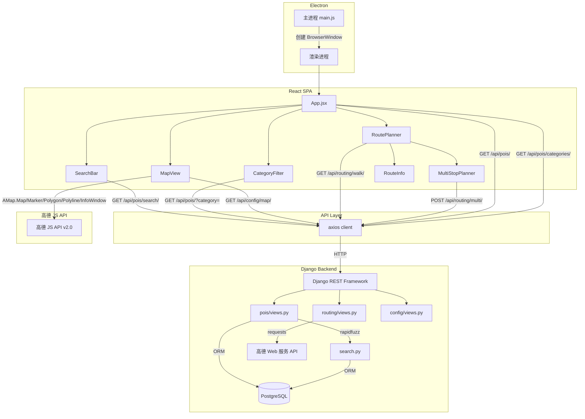

# 技术设计规范 (Design-First Specification)

> **设计名称：** 校园导航系统前后端分离重构
> **设计粒度：** High Level Design
> **版本：** v1.0
> **状态：** 草稿
> **最后更新：** 2026-03-30

---

## 1. 设计概述

将现有 Flask 单体应用（Jinja2 模板渲染 + Vanilla JS）重构为前后端分离架构。后端采用 Django + Django REST Framework + PostgreSQL，前端采用 React SPA + Electron 桌面壳，地图服务保持高德地图 JS API v2.0 + Web 服务 API。本次为纯架构重构，所有现有功能 1:1 复现，不增不减。

必须先从设计出发的原因：用户已明确给定技术栈约束（Django+DRF、React+Electron、PostgreSQL），属于以架构决策驱动的重构，需求从设计中派生。

---

## 2. 设计起点与约束

### 2.1 已知设计输入

| 输入 | 详情 |
|------|------|
| 现有 POI 数据 | `campus_nav/data/poi.json`，52 条记录，分类包括：宿舍、食堂、教学楼、图书馆、运动场所、行政、餐饮、生活服务、其他 |
| 现有 API 契约 | 4 个端点：`GET /`、`GET /api/search`、`GET /api/route`、`POST /api/multi_route` |
| 高德 API 密钥 | JS API Key: `cef04be82ff504c6478e314bedcff919`；Web 服务 Key: `53dfc38a8185e0d8ffe8c17a2e0e2a9c` |
| 地图参数 | 中心点 `[103.988471, 30.581856]`，缩放级别 16，校区边界 22 个坐标点 |
| 搜索算法 | rapidfuzz `partial_ratio`，阈值 60，同时匹配 name 和 description |
| 分类颜色 | 7 种已定义颜色映射（食堂/教学楼/宿舍/图书馆/运动场所/行政/医疗），未匹配分类回退 `#4285F4` |

### 2.2 强约束

- **C-1:** 所有现有功能必须在新系统中 1:1 复现，不增不减
- **C-2:** 高德地图 JS API v2.0 和 Web 服务 API 的调用方式不变
- **C-3:** 后端必须使用 Django + DRF，前端必须使用 React + Electron
- **C-4:** 数据库必须使用 PostgreSQL
- **C-5:** 模糊搜索语义保持一致（rapidfuzz partial_ratio，阈值 60）

### 2.3 假设

- **A-1:** 开发环境为 Windows 11，Python 3.10+，Node.js 18+
- **A-2:** PostgreSQL 本地安装可用，默认端口 5432
- **A-3:** 高德 API 密钥在重构期间保持有效
- **A-4:** 不需要用户认证/授权系统（现有系统无此功能）
- **A-5:** Electron 应用仅面向桌面端，不需要移动端适配

---

## 3. 目标系统边界

### 3.1 涉及组件

| 组件 / 模块 | 作用 | 是否变更 |
|:---|:---|:---|
| Flask 后端 (`campus_nav/app.py`) | 现有 Web 服务器 + API | 是 — 替换为 Django + DRF |
| Jinja2 模板 (`templates/index.html`) | 服务端渲染页面 | 是 — 替换为 React SPA |
| Vanilla JS (`static/js/main.js`) | 前端交互逻辑 | 是 — 替换为 React 组件 |
| POI 数据 (`data/poi.json`) | 静态 JSON 数据 | 是 — 迁移至 PostgreSQL |
| 搜索逻辑 (`utils/poi.py`) | rapidfuzz 模糊搜索 | 是 — 迁移至 Django App |
| 路径规划 (`utils/graph.py`) | 高德 API 封装 | 是 — 迁移至 Django App |
| 配置 (`config.py`) | API 密钥、地图参数 | 是 — 迁移至 Django settings |
| CSS 样式 (`static/css/style.css`) | 页面样式 | 是 — 迁移至 React 项目 |

### 3.2 明确不在范围内

- 用户注册/登录/权限管理
- POI 数据的 CRUD 管理后台（仅提供数据迁移脚本）
- 移动端适配
- 离线地图缓存
- 实时定位功能
- CI/CD 流水线
- Docker 容器化部署

---

## 4. 方案设计

### 4.1 Monorepo 项目结构

```
CUIT_CampusNavigationSystem/
├── backend/                          # Django 后端
│   ├── manage.py
│   ├── requirements.txt
│   ├── campus_nav/                   # Django 项目配置
│   │   ├── __init__.py
│   │   ├── settings.py
│   │   ├── urls.py
│   │   └── wsgi.py
│   ├── pois/                         # POI 应用
│   │   ├── __init__.py
│   │   ├── models.py
│   │   ├── serializers.py
│   │   ├── views.py
│   │   ├── urls.py
│   │   ├── search.py
│   │   └── admin.py
│   ├── routing/                      # 路径规划应用
│   │   ├── __init__.py
│   │   ├── views.py
│   │   ├── urls.py
│   │   └── amap_client.py
│   ├── config/                       # 地图配置应用
│   │   ├── __init__.py
│   │   ├── views.py
│   │   └── urls.py
│   └── scripts/
│       └── migrate_poi_data.py       # poi.json → PostgreSQL 迁移脚本
├── frontend/                         # React + Electron 前端
│   ├── package.json
│   ├── electron/
│   │   ├── main.js
│   │   └── preload.js
│   ├── public/
│   │   └── index.html
│   ├── src/
│   │   ├── index.jsx
│   │   ├── App.jsx
│   │   ├── api/
│   │   │   ├── client.js
│   │   │   ├── poi.js
│   │   │   ├── route.js
│   │   │   └── config.js
│   │   ├── components/
│   │   │   ├── Navbar.jsx
│   │   │   ├── SearchBar.jsx
│   │   │   ├── CategoryFilter.jsx
│   │   │   ├── MapView.jsx
│   │   │   ├── RoutePlanner.jsx
│   │   │   ├── MultiStopPlanner.jsx
│   │   │   ├── RouteInfo.jsx
│   │   │   └── POIInfoWindow.jsx
│   │   ├── hooks/
│   │   │   ├── useMap.js
│   │   │   └── useRoute.js
│   │   ├── constants/
│   │   │   └── categoryColors.js
│   │   └── styles/
│   │       └── index.css
│   └── .env
└── campus_nav/                       # 原有代码（保留作参考）
```

### 4.2 调用链拓扑



### 4.3 关键接口与数据流

#### 4.3.1 REST API 设计

所有 API 前缀 `/api/`，返回 JSON。

| 方法 | 端点 | 说明 | 对应现有端点 |
|------|------|------|-------------|
| GET | `/api/pois/` | 获取所有 POI，支持 `?category=xxx` 筛选 | `GET /`（模板注入 POIS） |
| GET | `/api/pois/categories/` | 获取所有分类列表 | `GET /`（模板注入 categories） |
| GET | `/api/pois/search/?q=xxx` | 模糊搜索 POI | `GET /api/search?q=xxx` |
| GET | `/api/routing/walk/?orig_lng=&orig_lat=&dest_lng=&dest_lat=` | 两点步行路径规划 | `GET /api/route?...` |
| POST | `/api/routing/multi/` | 多点路径规划 | `POST /api/multi_route` |
| GET | `/api/config/map/` | 获取地图配置 | `GET /`（模板注入配置） |

#### 4.3.2 API 响应格式

**GET /api/pois/**
```json
[
  {
    "id": 1,
    "name": "一食堂",
    "category": "食堂",
    "lng": 103.98505,
    "lat": 30.579183,
    "description": "航空港校区第一食堂"
  }
]
```

**GET /api/pois/categories/**
```json
["行政", "宿舍", "教学楼", "生活服务", "运动场所", "食堂", "图书馆", "餐饮"]
```

**GET /api/pois/search/?q=食堂**
```json
[
  {
    "id": 22,
    "name": "一食堂",
    "category": "食堂",
    "lng": 103.98505,
    "lat": 30.579183,
    "description": "航空港校区第一食堂",
    "score": 100
  }
]
```

**GET /api/routing/walk/**
```json
{
  "coords": [[103.98505, 30.579183], [103.98510, 30.579200]],
  "distance": 350,
  "duration": 4.5
}
```

**POST /api/routing/multi/** — 请求体：
```json
{
  "stops": [
    {"lng": 103.98505, "lat": 30.579183},
    {"lng": 103.98862, "lat": 30.579953}
  ]
}
```
响应体：同 walk 格式。

**GET /api/config/map/**
```json
{
  "amap_js_key": "cef04be82ff504c6478e314bedcff919",
  "center": [103.988471, 30.581856],
  "zoom": 16,
  "boundary": [[103.984298, 30.57835], ...]
}
```

**错误响应格式：**
```json
{"error": "错误描述信息"}
```
HTTP 状态码：400（参数错误）、500（服务端错误）。

### 4.4 数据模型

#### 4.4.1 PostgreSQL 表结构

**category 表**

| 字段 | 类型 | 约束 | 说明 |
|------|------|------|------|
| id | SERIAL | PK | 自增主键 |
| name | VARCHAR(50) | UNIQUE, NOT NULL | 分类名称 |
| color | VARCHAR(7) | NOT NULL, DEFAULT '#4285F4' | 十六进制颜色值 |

**poi 表**

| 字段 | 类型 | 约束 | 说明 |
|------|------|------|------|
| id | SERIAL | PK | 自增主键 |
| name | VARCHAR(100) | NOT NULL | POI 名称 |
| category_id | FK(category.id) | NOT NULL, ON DELETE PROTECT | 所属分类 |
| lng | DECIMAL(9,6) | NOT NULL | 经度 |
| lat | DECIMAL(8,6) | NOT NULL | 纬度 |
| description | TEXT | DEFAULT '' | 描述 |

#### 4.4.2 Django Models

```python
# pois/models.py
from django.db import models

class Category(models.Model):
    name = models.CharField(max_length=50, unique=True)
    color = models.CharField(max_length=7, default='#4285F4')

    class Meta:
        db_table = 'category'
        ordering = ['name']

    def __str__(self):
        return self.name


class POI(models.Model):
    name = models.CharField(max_length=100)
    category = models.ForeignKey(
        Category, on_delete=models.PROTECT, related_name='pois'
    )
    lng = models.DecimalField(max_digits=9, decimal_places=6)
    lat = models.DecimalField(max_digits=8, decimal_places=6)
    description = models.TextField(default='', blank=True)

    class Meta:
        db_table = 'poi'
        ordering = ['id']

    def __str__(self):
        return self.name
```

#### 4.4.3 分类-颜色完整映射

| 分类 | 颜色 | 来源 |
|------|------|------|
| 食堂 | #FF4444 | main.js 已定义 |
| 教学楼 | #4285F4 | main.js 已定义 |
| 宿舍 | #34A853 | main.js 已定义 |
| 图书馆 | #9C27B0 | main.js 已定义 |
| 运动场所 | #FF9800 | main.js 已定义 |
| 行政 | #607D8B | main.js 已定义 |
| 医疗 | #E91E63 | main.js 已定义 |
| 餐饮 | #FF6D00 | 新增 |
| 其他 | #795548 | 新增 |
| 生活服务 | #00BCD4 | 新增 |

### 4.5 Django 后端架构

#### 4.5.1 settings.py 关键配置

```python
INSTALLED_APPS = [
    'django.contrib.admin',
    'django.contrib.auth',
    'django.contrib.contenttypes',
    'rest_framework',
    'corsheaders',
    'pois',
    'routing',
    'config',
]

MIDDLEWARE = [
    'corsheaders.middleware.CorsMiddleware',
    # ... 其他中间件
]

CORS_ALLOWED_ORIGINS = [
    'http://localhost:3000',  # React dev server
]

REST_FRAMEWORK = {
    'DEFAULT_RENDERER_CLASSES': [
        'rest_framework.renderers.JSONRenderer',
    ],
    'DEFAULT_PAGINATION_CLASS': None,  # POI 数据量小，不分页
}

DATABASES = {
    'default': {
        'ENGINE': 'django.db.backends.postgresql',
        'NAME': 'campus_nav',
        'USER': 'postgres',
        'PASSWORD': '',  # 从环境变量读取
        'HOST': 'localhost',
        'PORT': '5432',
    }
}

# 高德地图配置
AMAP_JS_KEY = 'cef04be82ff504c6478e314bedcff919'
AMAP_WEB_KEY = '53dfc38a8185e0d8ffe8c17a2e0e2a9c'
MAP_CENTER = [103.988471, 30.581856]
MAP_ZOOM = 16
CAMPUS_BOUNDARY = [
    [103.984298, 30.57835],
    # ... 22 个坐标点（从现有 config.py 迁移）
]
```

#### 4.5.2 URL 路由结构

```python
# campus_nav/urls.py (根路由)
urlpatterns = [
    path('api/pois/', include('pois.urls')),
    path('api/routing/', include('routing.urls')),
    path('api/config/', include('config.urls')),
    path('admin/', admin.site.urls),
]

# pois/urls.py
urlpatterns = [
    path('', views.POIListView.as_view()),
    path('categories/', views.CategoryListView.as_view()),
    path('search/', views.POISearchView.as_view()),
]

# routing/urls.py
urlpatterns = [
    path('walk/', views.WalkingRouteView.as_view()),
    path('multi/', views.MultiRouteView.as_view()),
]

# config/urls.py
urlpatterns = [
    path('map/', views.MapConfigView.as_view()),
]
```

#### 4.5.3 搜索逻辑 (pois/search.py)

保持与现有系统完全一致的搜索语义：

```python
from rapidfuzz import fuzz

def search_pois(queryset, keyword, threshold=60):
    results = []
    for poi in queryset:
        score = max(
            fuzz.partial_ratio(keyword, poi.name),
            fuzz.partial_ratio(keyword, poi.description or '')
        )
        if score >= threshold:
            results.append((poi, score))
    results.sort(key=lambda x: x[1], reverse=True)
    return results
```

POI 数据量极小（52 条），全表扫描 + Python 端 rapidfuzz 计算完全可行。

### 4.6 React 前端架构

#### 4.6.1 组件树

```
App
├── Navbar                          # 顶部导航栏
├── SearchBar                       # 搜索输入 + 结果下拉列表
├── CategoryFilter                  # 分类筛选按钮组
├── MapView                         # 高德地图容器
│   └── (AMap.Marker, InfoWindow, Polygon, Polyline — 命令式操作)
└── RoutePlanner                    # 路径规划面板
    ├── POISelect (起点/终点)
    ├── MultiStopPlanner            # 多点途经点管理
    └── RouteInfo                   # 路径距离/时间展示
```

#### 4.6.2 状态管理

使用 React 内置状态管理（useState + useContext），不引入 Redux。理由：应用状态简单。

```
AppContext:
  pois: POI[]                    # 全部 POI（启动时加载一次）
  categories: string[]           # 分类列表
  mapConfig: MapConfig           # 地图配置
  selectedCategory: string|null  # 当前选中分类
  filteredPois: POI[]            # 筛选后的 POI（派生状态）
  routeResult: RouteResult|null  # 当前路径规划结果
```

#### 4.6.3 高德地图集成

使用 `@amap/amap-jsapi-loader` 官方加载器 + 自定义 `useMap` Hook 封装所有地图操作。

不使用第三方 react-amap 封装，理由：官方维护兼容性好，高德 API 本质是命令式的。

#### 4.6.4 API 调用层

基于 axios 封装，`baseURL` 通过环境变量配置：

```javascript
// api/client.js
import axios from 'axios';
const client = axios.create({
  baseURL: process.env.REACT_APP_API_BASE || 'http://localhost:8000/api',
  timeout: 10000,
});
export default client;
```

### 4.7 Electron 集成方案

```
Electron
├── 主进程 (electron/main.js)
│   ├── 创建 BrowserWindow (1200x800, min 900x600)
│   ├── 开发模式：加载 http://localhost:3000
│   └── 生产模式：加载 build/index.html
└── 渲染进程
    └── React SPA（与浏览器运行完全一致）
```

- contextIsolation: true, nodeIntegration: false
- 打包工具：electron-builder，输出 Windows 安装包
- 开发流程：先启动 React dev server (3000)，再启动 Electron

### 4.8 前后端通信 (CORS)

- 开发环境：React `localhost:3000` → Django `localhost:8000`，通过 `django-cors-headers` 配置
- 生产环境（Electron）：React 构建产物通过 `file://` 加载，需在 CORS 中额外允许或通过 Electron 代理

---

## 5. 备选方案与取舍

| 方案 | 结论 | 原因 |
|:---|:---|:---|
| Flask 保留 + 前端分离 | 放弃 | 用户明确要求 Django + DRF |
| FastAPI 替代 Django | 放弃 | 用户明确选择 Django + DRF |
| SQLite 替代 PostgreSQL | 放弃 | 用户明确选择 PostgreSQL |
| Redux 状态管理 | 放弃 | 应用状态简单，useState + useContext 足够 |
| react-amap 第三方库 | 放弃 | 官方 @amap/amap-jsapi-loader 更可控，高德 API 本质命令式 |
| Vite 替代 CRA | 可选 | Vite 构建更快，但 CRA 与 Electron 集成文档更成熟 |

---

## 6. 风险与验证策略

### 6.1 主要风险

- **R-1:** 高德地图 JS API 在 Electron 中的兼容性（file:// 协议下可能受限）
- **R-2:** CORS 在 Electron 生产模式下的行为（file:// origin）
- **R-3:** rapidfuzz 搜索结果与现有系统的一致性（ORM 对象 vs 字典）
- **R-4:** PostgreSQL 本地环境配置差异

### 6.2 验证策略

- **V-1:** Electron 兼容性 — 早期搭建 Electron 壳并加载高德地图验证
- **V-2:** CORS — 开发阶段即验证 Electron 生产模式下的 API 调用
- **V-3:** 搜索一致性 — 用现有 poi.json 数据对比新旧系统搜索结果
- **V-4:** 数据迁移 — 迁移后对比 PostgreSQL 记录数与 poi.json 条目数

---

## 7. 派生需求提示

从本设计中将派生出的需求边界：
- POI 地图展示与分类筛选
- POI 模糊搜索
- 两点步行路径规划
- 多点路径规划
- 地图交互（标记、信息窗口、校区边界）
- Electron 桌面应用启动与窗口管理

明确不能从本设计派生出的能力：
- 用户认证与权限
- POI 数据管理（增删改）
- 离线地图
- 移动端支持

---

## 8. 审批记录

| 日期 | 审批人 | 决定 | 备注 |
|:---|:---|:---|:---|
| — | — | 待审批 | — |
